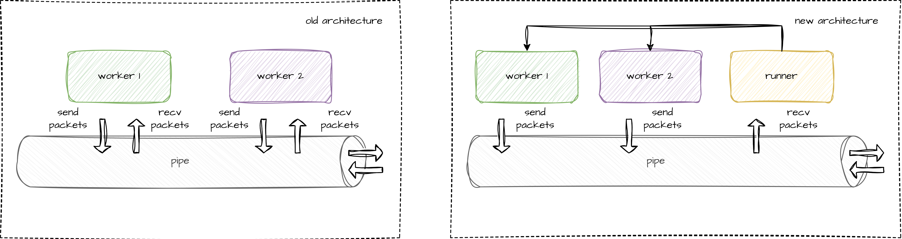
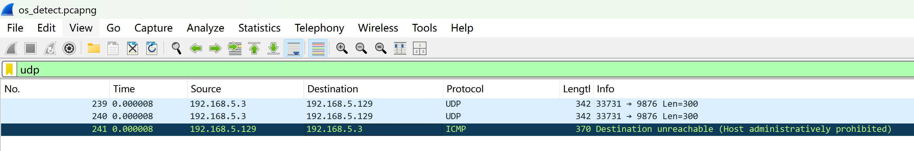

# pistol-rs

The library must be run as root (Linux, *BSD), the `stable` version of rust is recommended.

[](https://github.com/rikonaka/pistol-rs/actions/workflows/rust.yml)

nmap db version: 7.97

pistol update date: 2025-7-27

updated: nmap-mac-prefixes, nmap-os-db, nmap-service-probes

not updated: nmap-os-db-ipv6 (no changes from the last update 7.95)

## Import from crates.io

```toml
[dependencies]
pistol = "^4"
```

On Windows, download `winpcap` [here](https://www.winpcap.org/install/) or `npcap` [here](https://npcap.com/#download) SDK, then place `Packet.lib` from the `Lib/x64` folder in your root of code (Note: the `npcap` did not test by libpnet according to the doc of libpnet).

## Cross Platform Support

| Platform           | Note                         |
| :----------------- | :--------------------------- |
| Linux              | supported                    |
| Unix (*BSD, MacOS) | supported                    |
| Windows            | supported (winpcap or npcap) |

## Cargo Feature Flags

Since version v3.2.0, features are supported, keywords including `scan`, `ping`, `flood`, `os`, `vs`, `trace`.

## New Architecture



In the architecture before v4.0.0, when `pistol` sends data packets, each thread completes the sending and receiving of data packets by itself. This is no problem for a single-threaded environment, but in the subsequent use of multiple threads, when the first thread sends a data packet and waits for the returned data, if there is a second thread also waiting for the return of data at this time and the data packet is read by the second thread, and the first thread will not be able to receive the returned data packet. This can cause uncertainty in the scan results.

So the overall architecture was redesigned. Now each thread sends its own data packet, at the same time, there is a `Runner` thread (in fact, each interface has a thread listening). When the data packet returns, the `Runner` thread checks each data packet, intercepts the qualified data packets and returns them to the required thread.

## Host Discovery (Ping Scanning)

The implementation of the `pistol` host discovery according to the nmap [documentation](https://nmap.org/book/host-discovery.html).

| Method                     | Detailed Documentation                                                                         | Note                            |
| :------------------------- | :--------------------------------------------------------------------------------------------- | :------------------------------ |
| [x] TCP SYN Ping           | [nmap reference](https://nmap.org/book/host-discovery-techniques.html#host-discovery-PS)       | IPv4 & IPv6                     |
| [x] TCP ACK Ping           | [nmap reference](https://nmap.org/book/host-discovery-techniques.html#host-discovery-PA)       | IPv4 & IPv6                     |
| [x] UDP Ping               | [nmap reference](https://nmap.org/book/host-discovery-techniques.html#host-discovery-PU)       | IPv4 & IPv6                     |
| [x] ICMP Echo Ping         | [nmap reference](https://nmap.org/book/host-discovery-techniques.html#host-discovery-icmpping) | IPv4 (ICMP) & IPv6 (ICMPv6)     |
| [x] ICMP Timestamp Ping    | [nmap reference](https://nmap.org/book/host-discovery-techniques.html#host-discovery-icmpping) | IPv4  (ICMP)                    |
| [x] ICMP Address Mask Ping | [nmap reference](https://nmap.org/book/host-discovery-techniques.html#host-discovery-icmpping) | IPv4  (ICMP)                    |
| [x] ARP Scan               | [nmap reference](https://nmap.org/book/host-discovery-techniques.html#arp-scan)                | IPv4                            |
| [x] NDP NS Scan            |                                                                                                | IPv6                            |
| [ ] IP Protocol Ping       | [nmap reference](https://nmap.org/book/host-discovery-techniques.html#host-discovery-PO)       | Complicated and not very useful |

## Port Scanning Techniques and Algorithms

The implementation of the `pistol` port scan according to the nmap [pdf](https://nmap.org/nmap_doc.html) and [documentation](https://nmap.org/book/scan-methods.html).

Additionally, since version `v3.1.6`, pistol has compiled 100 and 1000 commonly used ports (`TOP_100_PORTS`, `TOP_1000_PORTS`, `TOP_100_TCP_PORTS`, `TOP_1000_TCP_PORTS`, `TOP_100_UDP_PORTS`,`TOP_1000_UDP_PORTS`) in nmap to speed up scanning.


| Method                  | Detailed Documentation                                                       | Note                                    |
| :---------------------- | :--------------------------------------------------------------------------- | :-------------------------------------- |
| [x] TCP SYN Scan        | [nmap reference](https://nmap.org/book/synscan.html)                         | IPv4 & IPv6                             |
| [x] TCP Connect Scan    | [nmap reference](https://nmap.org/book/scan-methods-connect-scan.html)       | IPv4 & IPv6                             |
| [x] TCP FIN Scan        | [nmap reference](https://nmap.org/book/scan-methods-null-fin-xmas-scan.html) | IPv4 & IPv6                             |
| [x] TCP Null Scan       | [nmap reference](https://nmap.org/book/scan-methods-null-fin-xmas-scan.html) | IPv4 & IPv6                             |
| [x] TCP Xmas Scan       | [nmap reference](https://nmap.org/book/scan-methods-null-fin-xmas-scan.html) | IPv4 & IPv6                             |
| [x] TCP ACK Scan        | [nmap reference](https://nmap.org/book/scan-methods-ack-scan.html)           | IPv4 & IPv6                             |
| [x] TCP Window Scan     | [nmap reference](https://nmap.org/book/scan-methods-window-scan.html)        | IPv4 & IPv6                             |
| [x] TCP Maimon Scan     | [nmap reference](https://nmap.org/book/scan-methods-maimon-scan.html)        | IPv4 & IPv6                             |
| [x] UDP Scan            | [nmap reference](https://nmap.org/book/scan-methods-udp-scan.html)           | IPv4 & IPv6                             |
| [x] TCP Idle Scan       | [nmap reference](https://nmap.org/book/idlescan.html)                        | IPv4                                    |
| [ ] IP Protocol Scan    | [nmap reference](https://nmap.org/book/scan-methods-ip-protocol-scan.html)   | Complicated and not very useful         |
| [ ] TCP FTP Bounce Scan | [nmap reference](https://nmap.org/book/scan-methods-ftp-bounce-scan.html)    | The bugs exploited have long been fixed |

## Flood Attack

| Method                | Note                                |
| :-------------------- | :---------------------------------- |
| [x] TCP SYN Flood     | IPv4 & IPv6 support                 |
| [x] TCP ACK Flood     | IPv4 & IPv6 support                 |
| [x] TCP ACK PSH Flood | IPv4 & IPv6 support                 |
| [x] UDP Flood         | IPv4 & IPv6 support                 |
| [x] ICMP Flood        | IPv4 (ICMP) & IPv6 (ICMPv6) support |

## Trace Route

| Method            | Note                                |
| :---------------- | :---------------------------------- |
| [x] TCP SYN Trace | IPv4 & IPv6 support                 |
| [x] UDP Trace     | IPv4 & IPv6 support                 |
| [x] ICMP Trace    | IPv4 (ICMP) & IPv6 (ICMPv6) support |

## Remote OS Detection

| Method             | Detailed Documentation                                             | Note                                           |
| :----------------- | :----------------------------------------------------------------- | :--------------------------------------------- |
| [x] IPv4 OS Detect | [nmap reference](https://nmap.org/book/osdetect-methods.html)      | Print fingerprint as nmap format now supported |
| [x] IPv6 OS Detect | [nmap reference](https://nmap.org/book/osdetect-ipv6-methods.html) | Print fingerprint as nmap format now supported |


### OS Detection on IPv6?

On ipv6, the fingerprints are unreadable and meaningless to humans, see [here](https://nmap.org/book/osdetect-fingerprint-format.html#osdetect-ex-typical-reference-fprint-ipv6) for details, and nmap uses logistic regression to match target OS on ipv6, but the matching algorithm is quite outdated with confusing design logic.

The first is about the `ST`, `RT` and `EXTRA` metrics in fingerprints in detection on [ipv6](https://nmap.org/book/osdetect-fingerprint-format.html), these three metrics are not used at all in the code, at the same time, there is no detailed description of how `ST` and `RT` are calculated, I don't know why nmap would keep them in the final fingerprint.

The second is `NI` probes. In the relevant [document](https://nmap.org/book/osdetect-ipv6-methods.html#osdetect-features-ipv6) of nmap, it describes the specific structure of `NI` probe, but I don't see anything about it in the code, and it seems to completely ignore this probe when do predict use logistic regression.

Furthermore, for the current mainstream operating systems, ipv6 fingerprint support is not as rich as ipv4, so try the ipv4 first.

## Service and Application Version Detection

| Methods               | Detailed Documentation                                       |
| :-------------------- | :----------------------------------------------------------- |
| [x] IPv4 Service Scan | [nmap reference](https://nmap.org/book/vscan-technique.html) |
| [x] IPv6 Service Scan | [nmap reference](https://nmap.org/book/vscan-technique.html) |

When implementing this module, I found that the biggest problem was that Rust's `Regex` library (including `FancyRegex`) could not perfectly adapt to nmap's regular expressions. The `PCRE` regular expression engine is used in the original C++ code of nmap, so that it can match non-ASCII printable characters like `\0` (the value is `0u8`). 

```c
#include <stdio.h>
#include <pcre.h>

int main() {
    const char *pattern = "\x00";
    const char *subject = "abc\0def";

    pcre *re = pcre_compile(pattern, 0, NULL, NULL, NULL);
    if (re == NULL) {
        printf("Regex compile failed\n");
        return 1;
    }

    int ovector[30];
    int rc = pcre_exec(re, NULL, subject, strlen(subject) + 1, 0, 0, ovector, 30);
    if (rc >= 0) {
        printf("Match found at position %d\n", ovector[0]);
    } else {
        printf("No match found\n");
    }

    pcre_free(re);
    return 0;
}

```

But in Rust, it is impossible to include any special characters like `\0` in `&str` or `String`, and the existing regular expression engine is based on `&str` matching (not `&[u8]`), so I can only make some trade-offs and changes to build a bridge between nmap's original regular expression and the Rust regular expression engine.

I replaced the `\0` in the nmap regular expression with `\\0`, and then replaced the `0u8` in the received buff with the `\\0` string. Although this can perfectly solve the above problems in most cases, I found some unsolvable [problems](https://github.com/fancy-regex/fancy-regex/issues/149) in the process of replacing `\r` and `\n`, so the processing of `\r` and `\n` is to keep their original values ​​unchanged.

The existing method can only keep the regular expressions of nmap basically usable to a certain extent. Because there are many regular expressions of nmap, it is difficult to check them one by one. Therefore, when matching some services, the results may be different from the original nmap results. If so, please submit these services to issues for subsequent improvements.

## Debugs

### Show Logging Infomations and Capture All Pistol Traffic

This method is used to capture all packets sent and recv by pistol into pcapng format (which means you can open it with Wireshark).

```rust
use pistol::PistolRunner;
use pistol::PistolLogger;

fn main() {
    // Initialize and run the Runner thread.
    // This step is required for all other functions except service detection.
    let _pr = PistolRunner::init(
        PistolLogger::Info,                        // logger level settings
        Some(String::from("tcp_syn_scan.pcapng")), // capture pistol traffic for debugging if you want
        None,                                      // timeout settings, unless there is a clear reason, use the default here
    )
    .unwrap();
    // your scan or ping code
}
```

## Examples

### 0. Create the Target

Now you can include both IPv4 and IPv6 addresses in the `Target` when create the scan target, and `pistol` will automatically invoke the corresponding algorithm to handle it.

However, please note that some algorithms can only work with certain protocols, e.g. Idel scan can only be used with IPv4, if it is used with IPv6 it will do nothing and show a warning message.

```rust
use pistol::Target;
use std::net::Ipv4Addr;
use std::net::Ipv6Addr;

fn main() {
    let dst_ipv4 = Ipv4Addr::new(192, 168, 72, 134);
    let target1 = Target::new(dst_ipv4.into(), Some(vec![22, 99]));
    let dst_ipv6 = Ipv6Addr::new(0xfe80, 0, 0, 0, 0x020c, 0x29ff, 0xfeb6, 0x8d99);
    let target2 = Target::new(dst_ipv6.into(), Some(vec![443, 8080]));
    let targets = vec![host1, host2];
    // your code below
}
```

If you don't want to use `Target`, you can also use the `_raw` functions we provide, for example, the corresponding raw function for `tcp_syn_scan` is `tcp_syn_scan_raw`.

| Rich Function                      | Raw Function                           |
| :--------------------------------- | :------------------------------------- |
| mac_scan                           | arp_scan_raw (IPv4 Only)               |
| mac_scan                           | ndp_ns_scan_raw (IPv6 Only)            |
| tcp_syn_scan                       | tcp_syn_scan_raw                       |
| tcp_ack_scan                       | tcp_ack_scan_raw                       |
| tcp_connect_scan                   | tcp_connect_scan_raw                   |
| tcp_fin_scan                       | tcp_fin_scan_raw                       |
| tcp_idle_scan                      | tcp_idle_scan_raw                      |
| tcp_maimon_scan                    | tcp_maimon_scan_raw                    |
| tcp_null_scan                      | tcp_null_scan_raw                      |
| tcp_window_scan                    | tcp_window_scan_raw                    |
| tcp_xmas_scan                      | tcp_xmas_scan_raw                      |
| udp_scan                           | udp_scan_raw                           |
| icmp_echo_ping                     | icmp_echo_ping_raw                     |
| icmp_timestamp_ping (IPv4 Only)    | icmp_timestamp_ping_raw (IPv4 Only)    |
| icmp_address_mask_ping (IPv4 Only) | icmp_address_mask_ping_raw (IPv4 Only) |
| icmp_echo_ping                     | icmp_echo_ping_raw                     |
| tcp_ack_ping                       | tcp_ack_ping_raw                       |
| tcp_syn_ping                       | tcp_syn_ping_raw                       |
| udp_ping                           | udp_ping_raw                           |
| icmp_flood                         | icmp_flood_raw                         |
| tcp_ack_flood                      | tcp_ack_flood_raw                      |
| tcp_ack_psh_flood                  | tcp_ack_psh_flood_raw                  |
| tcp_syn_flood                      | tcp_syn_flood_raw                      |
| udp_flood                          | udp_flood_raw                          |
| os_detect                          | os_detect_raw                          |
| vs_scan                            | vs_scan_raw                            |

**Note that the `_raw` function is blocking.**

### 1. SYN Port Scan Example

```rust
use pistol::PistolRunner;
use pistol::PistolLogger;
use pistol::tcp_syn_scan;
use pistol::Target;
use std::net::Ipv4Addr;
use std::time::Duration;
use subnetwork::CrossIpv4Pool;

fn main() {
    // Initialize and run the Runner thread.
    // This step is required for all other functions except service detection.
    let _pr = PistolRunner::init(
        PistolLogger::None, // logger level settings
        Some(String::from("tcp_syn_scan.pcapng")), // capture pistol traffic for debugging
        None, // timeout settings, unless there is a clear reason, use the default here
    )
    .unwrap();
    // When using scanning, please use a real local address to get the return packet.
    // And for flood attacks, please consider using a fake address.
    // If the value here is None, the programme will automatically look up the available addresses from the existing interfaces on the device.
    // In some complex network environments, if the program cannot automatically identify the source IP address, you can set the source IP address manually here.
    let src_ipv4 = None;
    // If the value of `source port` is `None`, the program will generate the source port randomly.
    let src_port = None;
    let timeout = Some(Duration::new(1, 0));
    let start = Ipv4Addr::new(192, 168, 5, 1);
    let end = Ipv4Addr::new(192, 168, 5, 10);
    // The destination address is from 192.168.5.1 to 192.168.5.10.
    let subnet = CrossIpv4Pool::new(start, end).unwrap();
    let mut targets = vec![];
    for ip in subnet {
        // Test with a example port `22`
        let host = Target::new(ip.into(), Some(vec![22]));
        targets.push(host);
    }
    // Number of max attempts, it can also be understood as the maximum number of unsuccessful retries.
    let max_attempts = 2;
    let num_threads = Some(8);
    let ret = tcp_syn_scan(
        &targets,
        num_threads,
        src_ipv4,
        src_port,
        timeout,
        max_attempts,
    )
    .unwrap();
    println!("{}", ret);
}
```

#### Output

The local machine address I used for testing is `192.168.5.3`. This address's results should be skipped during the scan and no operation was performed. For the specific reasons, please see the end of the document **[Probe the loopback address and local machine](https://github.com/rikonaka/pistol-rs?tab=readme-ov-file#some-unsolvable-problems)** part.

```
+------------+--------------+------------+------------+------------+
|                Port Scan Results (max_attempts:2)                |
+------------+--------------+------------+------------+------------+
|     id     |     addr     |    port    |   status   | time cost  |
+------------+--------------+------------+------------+------------+
|     1      | 192.168.5.1  |     22     |  filtered  |   1.030s   |
+------------+--------------+------------+------------+------------+
|     2      | 192.168.5.2  |     22     |   closed   |  1.064 ms  |
+------------+--------------+------------+------------+------------+
|     3      | 192.168.5.3  |     22     |  filtered  |   1.030s   | -> This result should be ignored
+------------+--------------+------------+------------+------------+
|     4      | 192.168.5.4  |     22     |  offline   |   1.040s   |
+------------+--------------+------------+------------+------------+
|     5      | 192.168.5.5  |     22     |    open    |  0.954 ms  |
+------------+--------------+------------+------------+------------+
|     6      | 192.168.5.6  |     22     |  offline   |   1.039s   |
+------------+--------------+------------+------------+------------+
|     7      | 192.168.5.7  |     22     |  offline   |   1.039s   |
+------------+--------------+------------+------------+------------+
|     8      | 192.168.5.8  |     22     |  offline   |   1.039s   |
+------------+--------------+------------+------------+------------+
|     9      | 192.168.5.9  |     22     |  offline   |   1.039s   |
+------------+--------------+------------+------------+------------+
|     10     | 192.168.5.10 |     22     |  offline   |   1.039s   |
+------------+--------------+------------+------------+------------+
| total cost: 2.057s, avg cost: 0.206s, open ports: 1              |
+------------+--------------+------------+------------+------------+
```

Or

```rust
use pistol::PistolRunner;
use pistol::PistolLogger;
use pistol::tcp_syn_scan_raw;
use std::net::Ipv4Addr;
use std::time::Duration;

fn main() {
    // Initialize and run the Runner thread.
    // This step is required for all other functions except service detection.
    let _pr = PistolRunner::init(
        PistolLogger::None, // logger level settings
        Some(String::from("tcp_syn_scan_raw.pcapng")), // capture pistol traffic for debugging
        None, // timeout settings, unless there is a clear reason, use the default here
    )
    .unwrap();
    let dst_ipv4 = Ipv4Addr::new(192, 168, 5, 5);
    let dst_port = 80;
    let src_ipv4 = None;
    let src_port = None;
    let timeout = Some(Duration::new(1, 0));
    let (port_status, _time_cost) = tcp_syn_scan_raw(dst_ipv4.into(), dst_port, src_ipv4, src_port, timeout).unwrap();
    println!("{:?}", port_status);
}
```

### 2. Remote OS Detect Example

The test target server is Debian 12.

```rust
use pistol::Target;
use pistol::PistolRunner;
use pistol::PistolLogger;
use pistol::os::os_detect;
use std::net::Ipv4Addr;
use std::time::Duration;

fn main() {
    // Initialize and run the Runner thread.
    // This step is required for all other functions except service detection.
    let _pr = PistolRunner::init(
        PistolLogger::None, // logger level settings
        Some(String::from("os_detect.pcapng")), // capture pistol traffic for debugging
        None, // timeout settings, unless there is a clear reason, use the default here
    )
    .unwrap();

    // If the value of `src_ipv4` is `None`, the program will find it auto.
    let src_ipv4 = None;
    let dst_ipv4 = Ipv4Addr::new(192, 168, 5, 5);
    // dst_open_tcp_port must be a certain open tcp port.
    let dst_open_tcp_port = 22;
    // dst_closed_tcp_port must be a certain closed tcp port.
    let dst_closed_tcp_port = 8765;
    // dst_closed_udp_port must be a certain closed udp port.
    let dst_closed_udp_port = 9876;
    let target = Target::new(
        dst_ipv4.into(),
        Some(vec![
            dst_open_tcp_port, // The order of these three ports cannot be disrupted.
            dst_closed_tcp_port,
            dst_closed_udp_port,
        ]),
    );
    let timeout = Some(Duration::from_secs_f64(0.5));
    let top_k = 3;
    let num_threads = Some(8);

    // The `fingerprint` is the obtained fingerprint of the target OS.
    // Return the `top_k` best results (the number of os detect result may not equal to `top_k`), sorted by score.
    let ret = os_detect(&[target], num_threads, src_ipv4, top_k, timeout).unwrap();
    println!("{}", ret);
}
```

#### output

```
+---------+-------------+---------+---------+------------+-------------------------------------+-----------+
|                                            OS Detect Results                                             |
+---------+-------------+---------+---------+------------+-------------------------------------+-----------+
|   id    |    addr     |  rank   |  score  |     os     |                 cpe                 | time cost |
+---------+-------------+---------+---------+------------+-------------------------------------+-----------+
|    1    | 192.168.5.5 |   #1    | 75/101  | Linux 6.0  | cpe:/o:linux:linux_kernel:6.0 auto  |  4.078s   |
+---------+-------------+---------+---------+------------+-------------------------------------+-----------+
|    2    | 192.168.5.5 |   #2    | 74/101  | Linux 4.19 | cpe:/o:linux:linux_kernel:4.19 auto |  4.078s   |
+---------+-------------+---------+---------+------------+-------------------------------------+-----------+
|    3    | 192.168.5.5 |   #3    | 73/101  | Linux 5.4  | cpe:/o:linux:linux_kernel:5.4 auto  |  4.078s   |
+---------+-------------+---------+---------+------------+-------------------------------------+-----------+
| total used time: 4.078s, avg time cost: 4.078s                                                           |
+---------+-------------+---------+---------+------------+-------------------------------------+-----------+
```


### 3. Remote OS Detect Example on IPv6

The test target server is Debian 12.

```rust
use pistol::Target;
use pistol::PistolRunner;
use pistol::PistolLogger;
use pistol::os_detect;
use std::net::Ipv6Addr;
use std::time::Duration;
use std::str::FromStr;

fn main() {
    // Initialize and run the Runner thread.
    // This step is required for all other functions except service detection.
    let _pr = PistolRunner::init(
        PistolLogger::None, // logger level settings
        Some(String::from("os_detect_ipv6.pcapng")), // capture pistol traffic for debugging
        None, // timeout settings, unless there is a clear reason, use the default here
    )
    .unwrap();

    let src_ipv6 = None;
    let dst_ipv6 = Ipv6Addr::from_str("fe80::20c:29ff:fe2c:9e4").unwrap();
    let dst_open_tcp_port = 22;
    let dst_closed_tcp_port = 8765;
    let dst_closed_udp_port = 9876;
    let target = Target::new(
        dst_ipv6.into(),
        Some(vec![
            dst_open_tcp_port,
            dst_closed_tcp_port,
            dst_closed_udp_port,
        ]),
    );

    let timeout = Some(Duration::from_secs_f64(0.5));
    let top_k = 3;
    let num_threads = Some(8);
    let ret = os_detect(&[target], num_threads, src_ipv6, top_k, timeout).unwrap();
    println!("{}", ret);
}
```

#### Output

```
+---------+-------------------------+---------+---------+--------------------------+---------------------------------------------------------+-----------+
|                                                                   OS Detect Results                                                                    |
+---------+-------------------------+---------+---------+--------------------------+---------------------------------------------------------+-----------+
|   id    |          addr           |  rank   |  score  |            os            |                           cpe                           | time cost |
+---------+-------------------------+---------+---------+--------------------------+---------------------------------------------------------+-----------+
|    1    | fe80::20c:29ff:fe2c:9e4 |   #1    |   0.9   |        Linux 4.19        |             cpe:/o:linux:linux_kernel:4.19              |  5.954s   |
+---------+-------------------------+---------+---------+--------------------------+---------------------------------------------------------+-----------+
|    2    | fe80::20c:29ff:fe2c:9e4 |   #2    |   0.6   |     Linux 3.13 - 4.6     | cpe:/o:linux:linux_kernel:3 cpe:/o:linux:linux_kernel:4 |  5.954s   |
+---------+-------------------------+---------+---------+--------------------------+---------------------------------------------------------+-----------+
|    3    | fe80::20c:29ff:fe2c:9e4 |   #3    |   0.0   | Android 7.1 (Linux 3.18) |                                                         |  5.954s   |
+---------+-------------------------+---------+---------+--------------------------+---------------------------------------------------------+-----------+
| total used time: 5.954s, avg time cost: 5.954s                                                                                                         |
+---------+-------------------------+---------+---------+--------------------------+---------------------------------------------------------+-----------+
```

According to the nmap [documentation](https://nmap.org/book/osdetect-guess.html#osdetect-guess-ipv6), the `novelty` value must be less than `15` for the probe result to be meaningful, so when this value is greater than `15`, an empty list is returned. Same when the two highest OS classes have scores that differ by less than `10%`, the classification is considered ambiguous and not a successful match.


### 3. Remote Service Detect Example

* 192.168.5.5 - Debian 12 (ssh: 22, apache httpd: 80, apache tomcat: 8080)

```rust
use pistol::Target;
use pistol::PistolRunner;
use pistol::PistolLogger;
use pistol::vs_scan;
use std::net::Ipv4Addr;
use std::time::Duration;

fn main() {
    // Initialize and run the Runner thread.
    // This step is required for all other functions except service detection.
    let _pr = PistolRunner::init(
        PistolLogger::None, // logger level settings
        None,               // this capture will not work for vs scan, so just set it to None
        None, // timeout settings, unless there is a clear reason, use the default here
    )
    .unwrap();

    let dst_addr = Ipv4Addr::new(192, 168, 5, 5);
    let target = Target::new(dst_addr.into(), Some(vec![22, 80, 8080]));
    let timeout = Some(Duration::from_secs_f64(0.5));
    // only_null_probe = true, only_tcp_recommended = any, only_udp_recomended = any: only try the NULL probe (for TCP)
    // only_tcp_recommended = true: only try the tcp probe recommended port
    // only_udp_recommended = true: only try the udp probe recommended port
    let (only_null_probe, only_tcp_recommended, only_udp_recommended) = (false, true, true);
    let intensity = 7; // nmap default
    let num_threads = Some(8);
    let ret = vs_scan(
        &[target],
        num_threads,
        only_null_probe,
        only_tcp_recommended,
        only_udp_recommended,
        intensity,
        timeout,
    )
    .unwrap();
    println!("{}", ret);
}
```

#### Output

```
+----------+-------------+----------+----------+----------------------------------+-----------+
|                                    Service Scan Results                                     |
+----------+-------------+----------+----------+----------------------------------+-----------+
|    id    |    addr     |   port   | service  |           versioninfo            | time cost |
+----------+-------------+----------+----------+----------------------------------+-----------+
|    1     | 192.168.5.5 |    22    |   ssh    |            p:OpenSSH             |  15.829s  |
|          |             |          |          |     v:9.2p1 Debian 2+deb12u6     |           |
|          |             |          |          |          i:protocol 2.0          |           |
|          |             |          |          |             o:Linux              |           |
|          |             |          |          |   cpe:/a:openbsd:openssh:9.2p1   |           |
+----------+-------------+----------+----------+----------------------------------+-----------+
|    2     | 192.168.5.5 |    80    |   http   |          p:Apache httpd          |  18.735s  |
|          |             |          |          |             v:2.4.62             |           |
|          |             |          |          |            i:(Debian)            |           |
|          |             |          |          | cpe:/a:apache:http_server:2.4.62 |           |
+----------+-------------+----------+----------+----------------------------------+-----------+
|    3     | 192.168.5.5 |   8080   |   http   |         p:Apache Tomcat          |  17.378s  |
|          |             |          |          |       cpe:/a:apache:tomcat       |           |
+----------+-------------+----------+----------+----------------------------------+-----------+
| total used time: 51.942s, avg time cost: 17.314s                                            |
+----------+-------------+----------+----------+----------------------------------+-----------+
```

## 4. Flood Attack

```rust
use pistol::Target;
use pistol::PistolRunner;
use pistol::PistolLogger;
use pistol::tcp_syn_flood;
use std::net::Ipv4Addr;
use std::time::Duration;

fn main() {
    let _pr = PistolRunner::init(PistolLogger::None, None, None).unwrap();

    let dst_addr = Ipv4Addr::new(192, 168, 5, 5);
    let ports = Some(vec![22]);
    let target1 = Target::new(dst_addr.into(), ports);
    let num_threads = 30; // It can be simply understood as the number of attack threads.
    let retransmit_count = 10; // The number of times to retransmit the same attack packet.
    let repeat_count = 3; // The number of times each thread repeats the attack.
    let ret = tcp_syn_flood(&[target1], num_threads, retransmit_count, repeat_count).unwrap();
    println!("{}", ret);
}
```

For the above three parameters `num_threads`, `retransmit_count`, `repeat_count`, there is a vivid explanation. We generate a TCP SYN packet, including a fake source address and source port, and then we send this packet `3` times (`retransmit_count`) to the specific port of the target machine (the above example is port 22).

After that, we regenerate a new fake source address and fake source port and form a new TCP SYN packet. We repeat this operation `10` times (`repeat_count`).

Finally, we generate `30` threads (`num_threads`) to execute the above process.

### Output

We no longer use `threadpool` to limit the number of threads here, so please do it according to your ability (in the previous scan or ping function, we use `threadpool` to avoid system overload caused by too many threads when the target range is large).

```
+--------+-------------+-----------------------------------------------------------+
|                               Flood Attack Summary                               |
+--------+-------------+-----------------------------------------------------------+
|   id   |    addr     |                          report                           |
+--------+-------------+-----------------------------------------------------------+
|   1    | 192.168.5.5 | packets sent: 30(39.258MB), time cost: 2.738s(14.339MB/s) |
+--------+-------------+-----------------------------------------------------------+
```

If you increase the `num_threads`, `retransmit_count` and `repeat_count` above, the speed of attacks traffic will increase (if possible, increase `retransmit_count` is more efficient than improving `repeat_count` because it does not require rebuilding the package).

The `num_threads` parameter here is to control the total number of threads, and the value of `retransmit_count` should be much greater than the value of `repeat_count`.

The relationship between the three variables in my local test environment.

| num_threads | retransmit_count | repeat_count | sending speed |
| :---------- | :--------------- | :----------- | :------------ |
| 10          | 1                | 10           | 1.923MB/s     |
| 10          | 10               | 1            | 13.609MB/s    |
| 30          | 1                | 10           | 1.908MB/s     |
| 30          | 10               | 1            | 16.725MB/s    |
| 60          | 60               | 1            | 71.631MB/s    |
| 60          | 1                | 60           | 1.952MB/s     |
| 120         | 60               | 1            | 127.775MB/s   |
| 120         | 120              | 1            | 196.072MB/s   |
| 240         | 120              | 1            | 0.252GB/s     |
| 240         | 60               | 4            | 0.116GB/s     |
| 240         | 240              | 4            | 0.605GB/s     |
| 240         | 240              | 1            | 0.551GB/s     |
| 240         | 480              | 4            | 0.636GB/s     |

The above conclusions were drawn on my local VMware virtualized network card. The performance of the attack in a real attack environment depends on factors such as your network bandwidth and network card performance.

## Bugs About libpnet

**libpnet bug on Windows**

Bug issues: https://github.com/libpnet/libpnet/issues/707, the `libpnet` cannot get IPv6 address on Windows.

Therefore, until `libpnet` fixes this bug, IPv6 on Windows is not supported yet.

**libpnet bug on rust nightly version**

Bug issue: https://github.com/libpnet/libpnet/issues/686

## Bugs About Nmap

Since I sent emails to the nmap mailing list several times but never received a response, I will not repeat that step and instead post the Nmap bugs I found here.

### Bug 1 (nmap version 7.95)

> UDP (U1)
> This probe is a UDP packet sent to a closed port. The character 'C' (0x43) is repeated 300 times for the data field. The IP ID value is set to 0x1042 for operating systems which allow us to set this. If the port is truly closed and there is no firewall in place, Nmap expects to receive an ICMP port unreachable message in return. That response is then subjected to the R, DF, T, TG, IPL, UN, RIPL, RID, RIPCK, RUCK, and RUD tests.

When the detection target is CentOS7, when executing `U1` detection, CentOS7 will return an ICMP packet by default. At this time, the U1 field should be `R=Y` (returned), but nmap shows `R=N`.



The nmap output fingerprint:

```
SCAN(V=7.95%E=4%D=8/19%OT=22%CT=%CU=%PV=Y%DS=1%DC=D%G=N%M=000C29%TM=68A3D962%P=x86_64-pc-linux-gnu)
SEQ(SP=105%GCD=1%ISR=10B%TI=Z%TS=A)
SEQ(SP=FF%GCD=1%ISR=10C%TI=Z%II=I%TS=A)
OPS(O1=M5B4ST11NW7%O2=M5B4ST11NW7%O3=M5B4NNT11NW7%O4=M5B4ST11NW7%O5=M5B4ST11NW7%O6=M5B4ST11)
WIN(W1=7120%W2=7120%W3=7120%W4=7120%W5=7120%W6=7120)
ECN(R=Y%DF=Y%TG=40%W=7210%O=M5B4NNSNW7%CC=Y%Q=)
T1(R=Y%DF=Y%TG=40%S=O%A=S+%F=AS%RD=0%Q=)
T2(R=N)
T3(R=N)
T4(R=Y%DF=Y%TG=40%W=0%S=A%A=Z%F=R%O=%RD=0%Q=)
U1(R=N)
IE(R=Y%DFI=N%TG=40%CD=S)
```

And the pistol output fingerprint:

```
SCAN(V=pistol_4.0.16%D=8/19%OT=22%CT=8765%CU=9876PV=Y%DS=1%DC=D%G=Y%M=0C29%TM=68A3F024%P=RUST)
SEQ(SP=114%GCD=1%ISR=112%TI=Z%TS=A)
OPS(O1=M5B4ST11NW7%O2=M5B4ST11NW7%O3=M5B4NNT11NW7%O4=M5B4ST11NW7%O5=M5B4ST11NW7%O6=M5B4ST11)
WIN(W1=7120%W2=7120%W3=7120%W4=7120%W5=7120%W6=7120)
ECN(R=Y%DF=Y%T=40%W=7210%O=M5B4NNSNW7%CC=Y%Q=)
T1(R=Y%DF=Y%T=40%S=O%A=S+%F=AS%RD=0%Q=)
T2(R=N)
T3(R=N)
T4(R=Y%DF=Y%T=40%W=0%S=A%A=Z%F=R%O=%RD=0%Q=)
T5(R=N)
T6(R=N)
T7(R=N)
U1(R=Y%DF=N%T=40%IPL=164%UN=0%RIPL=G%RID=G%RIPCK=G%RUCK=G%RUD=G)
IE(R=Y%DFI=N%T=40%CD=S)
```

## Some Unsolvable Problems

**Probe the loopback address and local machine**

Because the entire `pistol`'s sending and receiving methods except services scan are based on the datalink layer, and the loopback address does not support sending ethernet frame data, but only at the transport layer. This means that when I send any data to local machine, I will not receive any response data packets.

And the transport layer design of `libpnet` lacks flexibility and customizability, for example there is `ipv4_packet_iter` method only and no `ipv6_packet_iter` method, it means that I cannot receive any ipv6 packets if I changes the `pistol`'s sending and receiving methods from datalink layer to transport layer, [reference](https://docs.rs/pnet/0.35.0/pnet/transport/index.html).

Therefore, `pistol` will not support loopback address speculation until a technical solution that can solve the above problem is found.