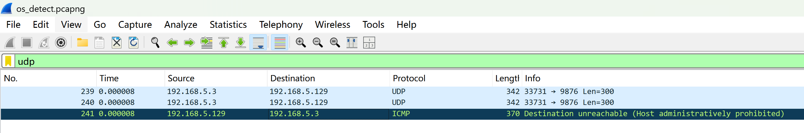

# Remote OS Detection Package Parsing

nmap version 7.95

Since I sent emails to the nmap mailing list several times but never received a response, I will not repeat that step and instead post the Nmap bugs I found here.

> From the Nmap documentation:
> UDP (U1). This probe is a UDP packet sent to a closed port. The character 'C' (0x43) is repeated 300 times for the data field. The IP ID value is set to 0x1042 for operating systems which allow us to set this. If the port is truly closed and there is no firewall in place, Nmap expects to receive an ICMP port unreachable message in return. That response is then subjected to the R, DF, T, TG, IPL, UN, RIPL, RID, RIPCK, RUCK, and RUD tests.

When the detection target is CentOS7, when executing `U1` detection, CentOS7 will return an ICMP packet by default. At this time, the `U1` field should be `R=Y` (returned), but nmap shows `R=N`.



The nmap output fingerprint:

```
SCAN(V=7.95%E=4%D=8/19%OT=22%CT=%CU=%PV=Y%DS=1%DC=D%G=N%M=000C29%TM=68A3D962%P=x86_64-pc-linux-gnu)
SEQ(SP=105%GCD=1%ISR=10B%TI=Z%TS=A)
SEQ(SP=FF%GCD=1%ISR=10C%TI=Z%II=I%TS=A)
OPS(O1=M5B4ST11NW7%O2=M5B4ST11NW7%O3=M5B4NNT11NW7%O4=M5B4ST11NW7%O5=M5B4ST11NW7%O6=M5B4ST11)
WIN(W1=7120%W2=7120%W3=7120%W4=7120%W5=7120%W6=7120)
ECN(R=Y%DF=Y%TG=40%W=7210%O=M5B4NNSNW7%CC=Y%Q=)
T1(R=Y%DF=Y%TG=40%S=O%A=S+%F=AS%RD=0%Q=)
T2(R=N)
T3(R=N)
T4(R=Y%DF=Y%TG=40%W=0%S=A%A=Z%F=R%O=%RD=0%Q=)
U1(R=N)
IE(R=Y%DFI=N%TG=40%CD=S)
```